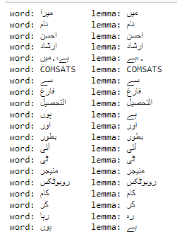
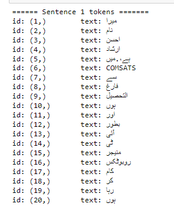
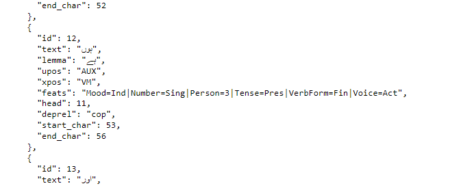
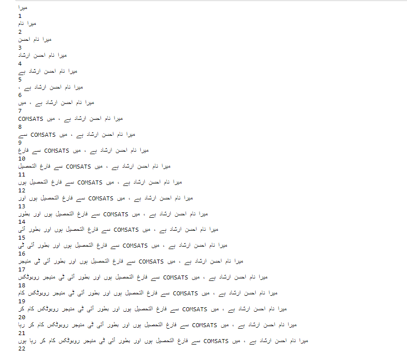
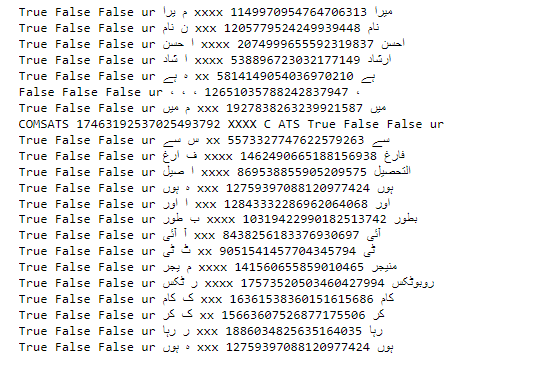

# Urdu_NLP_Stemming_Lemmatization

# Word and Its Lemmas

# Words and its Lemmas Sentence Wise

# Sentences Parts of Speech and Name Entity Recognitions

# Sentences Parts of Speech and Name Entity Recognitions

# Word Counts Recursively

